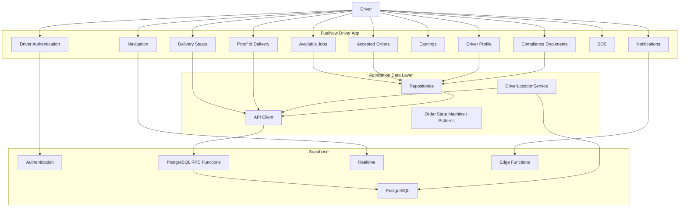
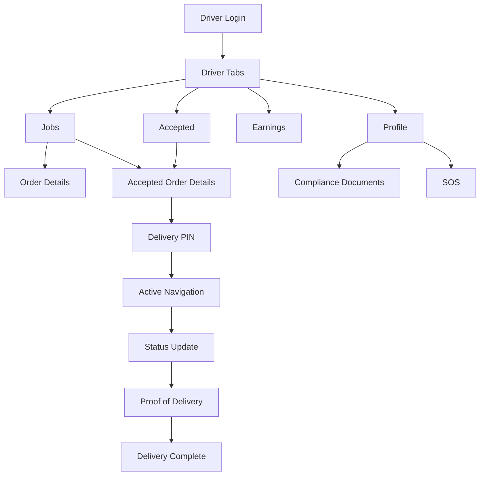
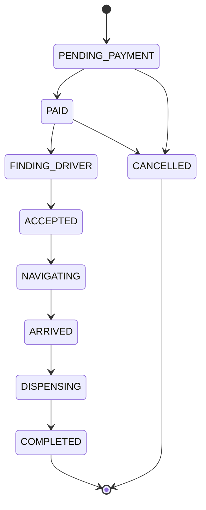
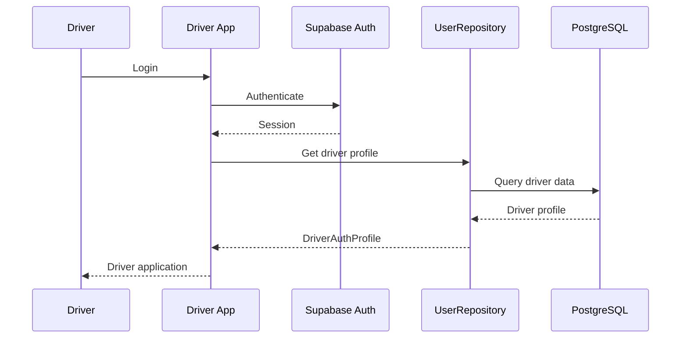
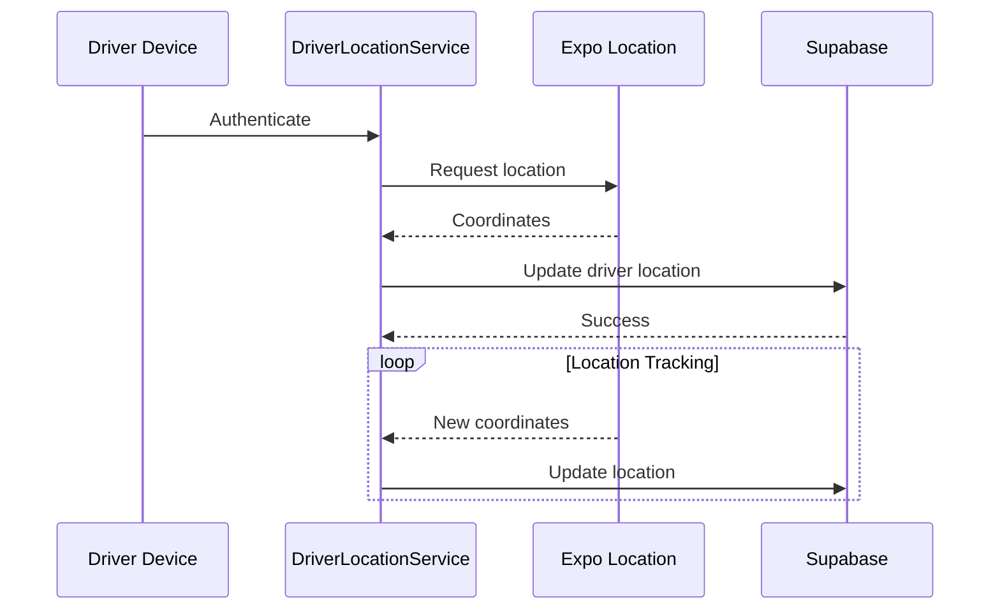
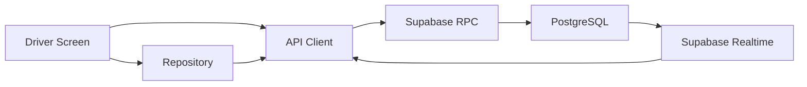
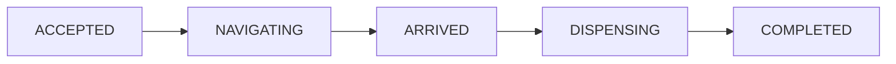
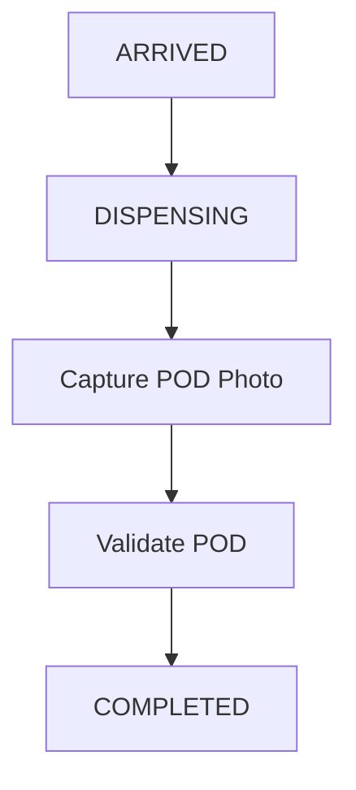
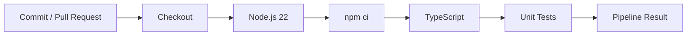
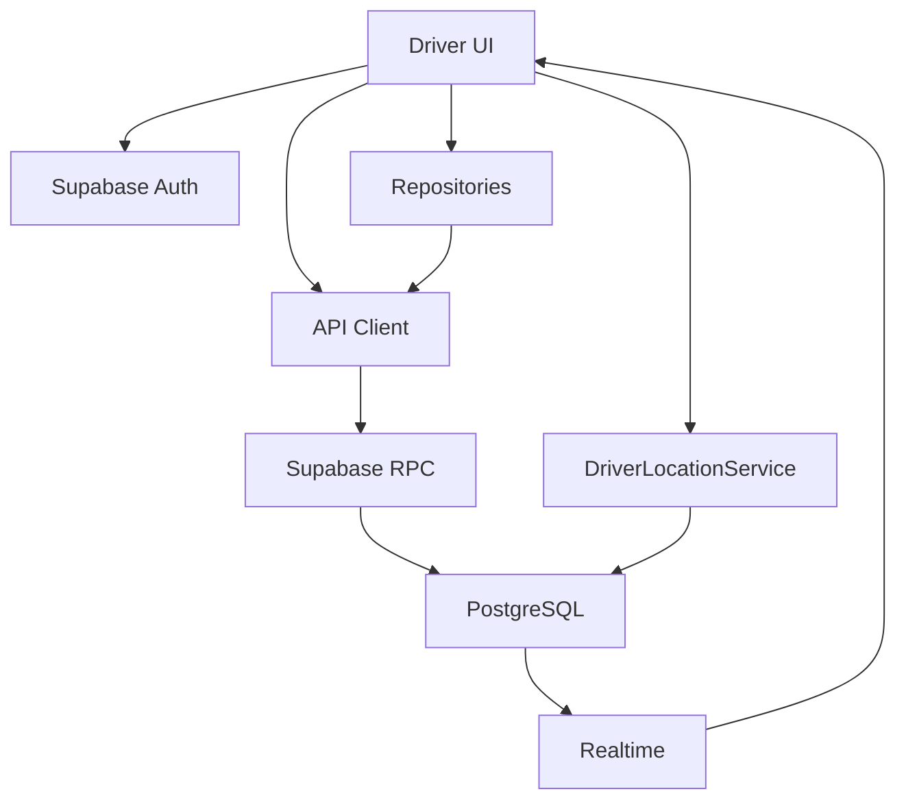

# FuelNow Driver App

The FuelNow Driver App is the driver-facing mobile application for the FuelNow fuel delivery platform.

Drivers use the application to authenticate, view available delivery jobs, accept orders, navigate to customers, update delivery status, capture proof of delivery, complete deliveries, monitor earnings, manage compliance documentation, receive notifications, and trigger SOS assistance.

The application is built with React Native and Expo and uses Supabase as its backend platform.

---

## 1. Application Overview



---

## 2. Technology Stack

| Technology           | Purpose                       |
| -------------------- | ----------------------------- |
| React Native         | Mobile application framework  |
| Expo SDK 57          | Native application tooling    |
| TypeScript           | Static typing                 |
| React Navigation     | Navigation                    |
| Supabase             | Backend platform              |
| PostgreSQL           | Application database          |
| Supabase RPC         | Database operations           |
| Supabase Realtime    | Live updates                  |
| Expo Location        | GPS                           |
| Expo Task Manager    | Background location tasks     |
| Expo SQLite          | Local/native storage support  |
| Expo Image Picker    | Proof-of-delivery images      |
| Expo Document Picker | Compliance documents          |
| Expo Crypto          | Secure application operations |
| Vitest               | Unit testing                  |

---

## 3. Project Structure

```text
FuelNow-Driver/
│
├── android/
│
├── assets/
│
├── __tests__/
│
├── src/
│   ├── components/
│   │
│   ├── context/
│   │
│   ├── patterns/
│   │
│   ├── repositories/
│   │
│   ├── screens/
│   │   ├── auth/
│   │   ├── driver/
│   │   └── notifications/
│   │
│   ├── services/
│   │   ├── apiClient.ts
│   │   ├── DriverLocationService.ts
│   │   └── supabase.ts
│   │
│   ├── theme/
│   │
│   └── types/
│
├── App.tsx
├── app.json
├── package.json
├── package-lock.json
└── vitest.config.ts
```

---

## 4. Navigation Architecture



---

## 5. Driver Workflow



The driver cannot accept a delivery without the appropriate driver assignment.

Proof of delivery is required before completion of the dispensing stage.

---

## 6. Driver Authentication

Driver authentication uses Supabase authentication and driver profile verification.



On application startup, the app attempts to restore the driver session.

The application also listens for Supabase authentication state changes.

---

## 7. GPS Tracking

The driver application contains:

```text
src/services/DriverLocationService.ts
```

The service is responsible for:

* Obtaining current driver location
* Sending driver location updates
* Starting location tracking
* Stopping location tracking
* Supporting background location tracking
* Updating the backend with current coordinates



---

## 8. Backend Architecture

The Driver App uses a shared typed API/data-access architecture.



---

## 9. Supabase RPC Interface

The Driver application uses the shared Supabase data model and API client.

Core user operations include:

```text
sign_in_with_password
get_user
create_user
update_user
delete_user
is_customer
```

Customer/order operations used by the shared API layer include:

```text
get_customer
get_order
create_order
update_order
delete_order
get_payment
create_payment
update_payment
delete_payment
```

Fuel data operations include:

```text
get_fuel_type
get_fuel_rate
```

The exact implementation and parameter mapping is maintained in:

```text
src/services/apiClient.ts
```

Driver-specific repository operations are contained within:

```text
src/repositories/
```

---

## 10. Order Status Updates

The driver uses controlled status transitions rather than allowing arbitrary order status changes.



The application uses dedicated screens for these stages:

```text
ActiveNavigationScreen
StatusUpdateScreen
ProofOfDeliveryScreen
DeliveryCompleteScreen
```

---

## 11. Proof of Delivery

Proof of delivery is captured before completing the delivery.



The driver application uses Expo image functionality for capturing delivery evidence.

---

## 12. Compliance Documents

Drivers can manage compliance documents through:

```text
ComplianceDocumentsScreen
```

The application supports document categories such as:

```text
Driver's Licence
Professional Driver Permit
Hazmat Certificate
Vehicle Permit
```

Documents can include:

```text
Document number
Expiry date
Expiry status
```

Document selection is supported through Expo's document picker functionality.

---

## 13. Driver Earnings

The application provides an earnings section accessible from:

```text
DriverEarningsTab
```

The screen provides driver-facing financial information associated with completed delivery activity.

---

## 14. SOS

The Driver App includes an SOS screen for emergency assistance.

```text
src/screens/driver/SOSScreen.tsx
```

SOS functionality is separated from normal order workflow so emergency actions can be accessed independently.

---

## 15. Environment Variables

The Driver App expects:

```env
EXPO_PUBLIC_SUPABASE_URL=your_supabase_url
EXPO_PUBLIC_SUPABASE_ANON_KEY=your_supabase_anon_key
```

These values should be provided through the local development environment or deployment configuration.

Never commit service-role credentials or private backend secrets.

---

## 16. Installation

Install dependencies:

```bash
npm ci
```

Start Expo:

```bash
npm start
```

Android:

```bash
npm run android
```

iOS:

```bash
npm run ios
```

Web:

```bash
npm run web
```

---

## 17. Testing

Run unit tests:

```bash
npm test
```

Watch mode:

```bash
npm run test:watch
```

TypeScript validation:

```bash
npx tsc --noEmit
```

The test suite covers driver application logic including order-state behavior and supporting functionality.

---

## 18. CI/CD

The Driver application uses GitHub Actions for automated validation.



---

## 19. Android Build

The project contains an Android native project generated/configured for Expo.

A local debug APK can be built with:

```bash
cd android
gradlew.bat assembleDebug
```

The debug APK is generated under:

```text
android/app/build/outputs/apk/debug/
```

Native dependency changes may require rebuilding the native Android project.

---

## 20. Driver Data Flow



---

## 21. Application Responsibilities

The Driver App is responsible for:

* Driver authentication
* Driver session restoration
* Available delivery jobs
* Order acceptance
* Accepted order management
* Navigation
* Delivery status updates
* Customer delivery PIN workflow
* Proof of delivery
* Delivery completion
* Driver earnings
* Driver profile
* Compliance documentation
* GPS tracking
* Background location tracking
* SOS functionality
* Notifications

Administrative functionality belongs to the FuelNow Admin application.

Customer-facing ordering functionality belongs to the FuelNow Customer application.

---

## 22. Development Architecture

The application follows this general flow:

```text
Driver Screens
      ↓
Repositories / Services
      ↓
API Client
      ↓
Supabase RPC / Realtime
      ↓
PostgreSQL
```

GPS tracking operates as a dedicated service:

```text
Expo Location
      ↓
DriverLocationService
      ↓
Supabase
      ↓
Driver Location Data
```

This separation keeps delivery workflow, location tracking, UI, and backend access independent from each other.
